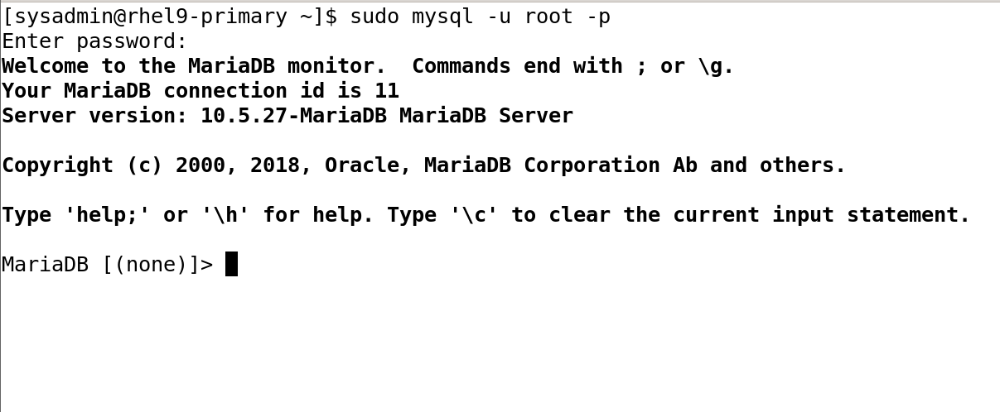
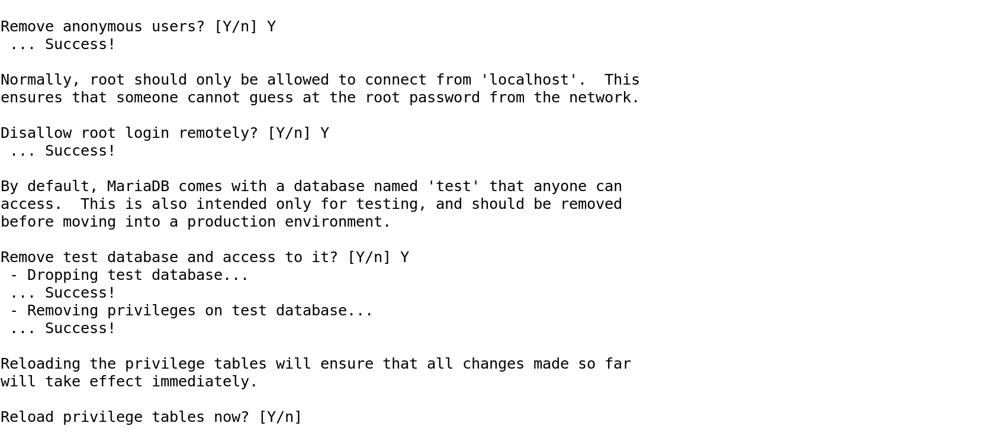
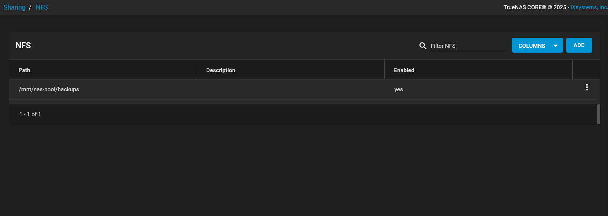
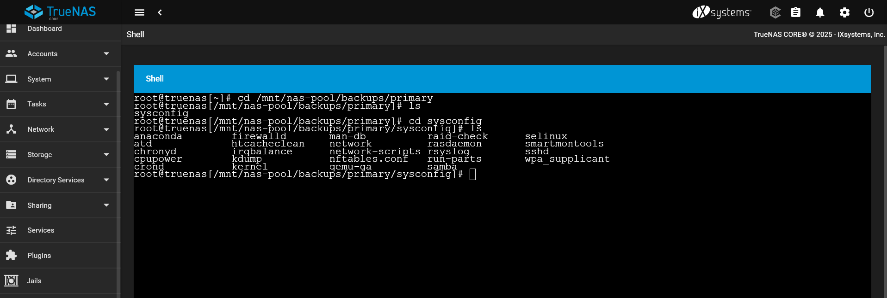

# 📸 Phase 2 Screenshots Documentation

---

## 1️⃣ Apache Web Server Setup (Primary VM)
- **Apache Status**
  
- **Firewall HTTP/HTTPS Rules**
  

---

## 2️⃣ MariaDB Installation & Configuration (Primary VM)
- **MariaDB Connection Test**
  
- **MariaDB Secure Installation**
  

---

## 3️⃣ NFS Shared Storage Configuration (Storage VM & TrueNAS)
- **TrueNAS NFS Settings**
  
- **Mounted NFS Storage**
  

---

## 4️⃣ Automated Backup with `rsync` (Primary & Storage VMs)
- **Cronjob Setup (Primary VM)**
  
- **Backup Files Verified on TrueNAS**
  
- **Backup Files Verified on Storage VM**
  

