# 📸 Phase 3 Screenshots Documentation

This file contains all **Phase 3 screenshots** with descriptions.

---

## 🔥 Security Hardening

- **SELinux Status Verification (`sestatus`)**
  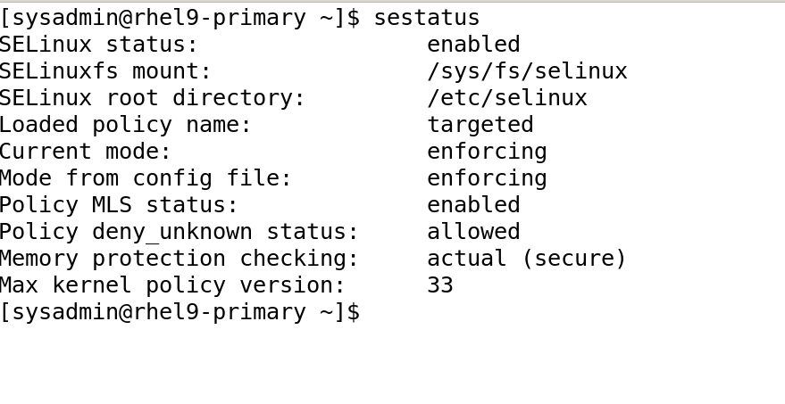

- **SELinux HTTP & HTTPS Policies**
  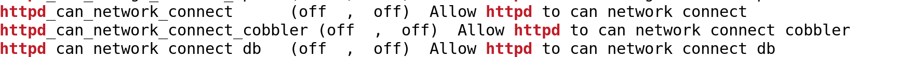
  

- **SSH Security Hardening**
  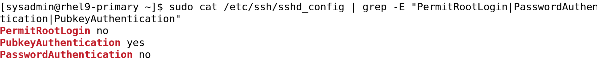

---

## 🔒 Fail2Ban Configuration

- **Fail2Ban Jail Config (`/etc/fail2ban/jail.local`)**
  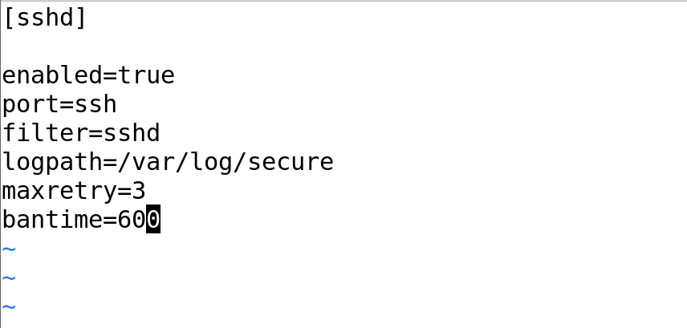

- **Fail2Ban Status (`fail2ban-client status sshd`)**
  

- **Auditd Logs for Failed Logins**
  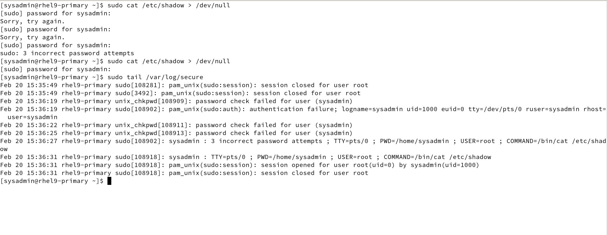

---

## ⚙️ Ansible Automation

- **Ansible Ping Test (`ansible all -m ping`)**
  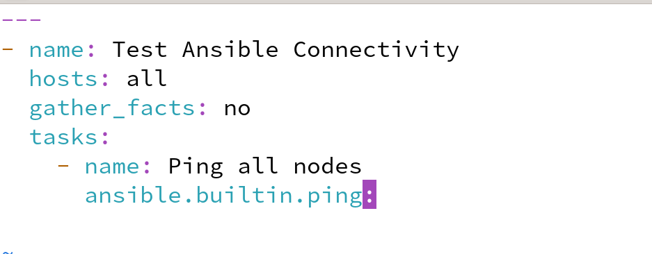
- **Ansible Playbook for Firewall**
  

- **Firewall Playbook Execution**
  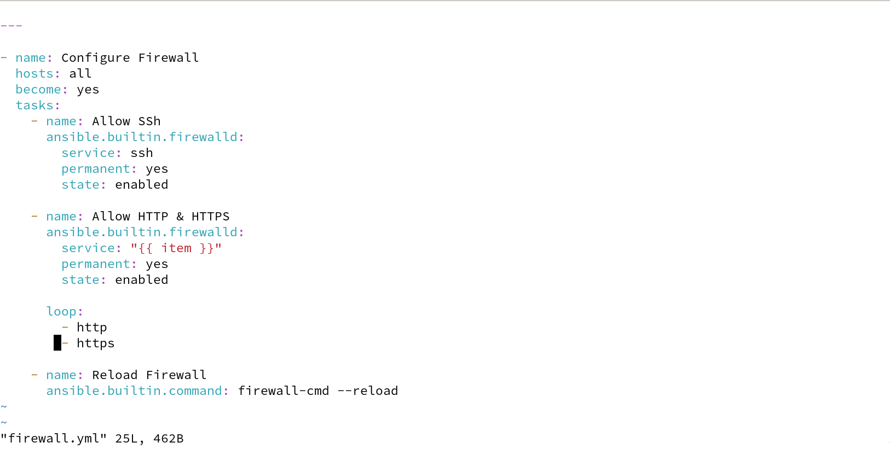

- **Ansible Playbook for User Management**
  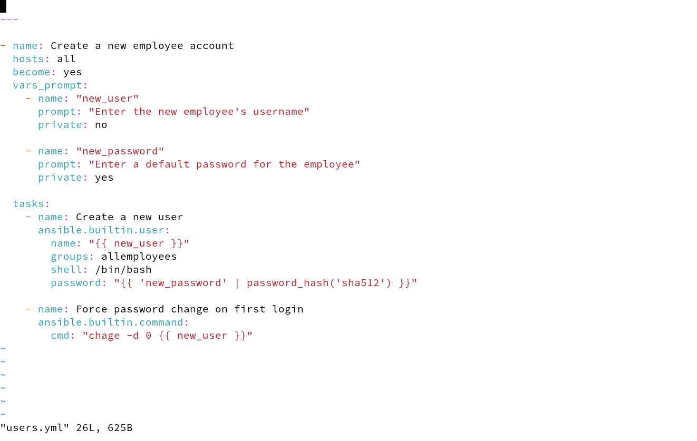

- **Ansible Playbook Execution for Users**
  ![Users Playbook Executed] (screenshots/Phase3/ansible_users_playbookRan.png)

- **User Created via Ansible**
  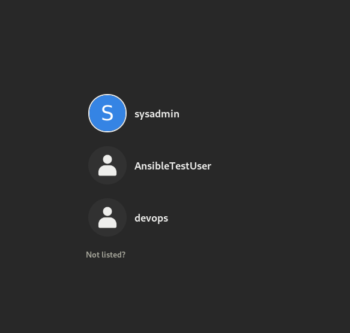

- **User Forced to Change Password at Login**
  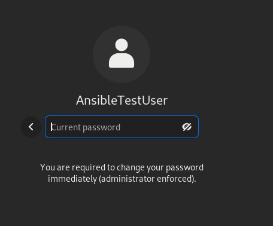

---

## 📜 Centralized Logging

- **Firewall Ports Open for Logging Server**
  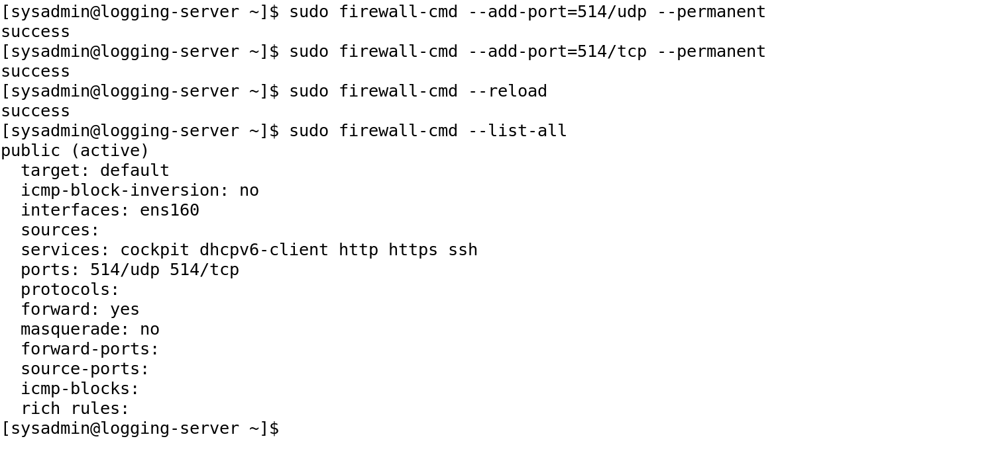

- **Logging Test Output**
  

---
