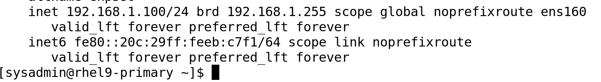
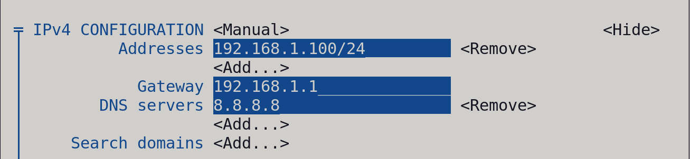
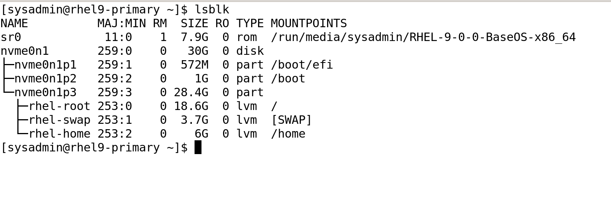
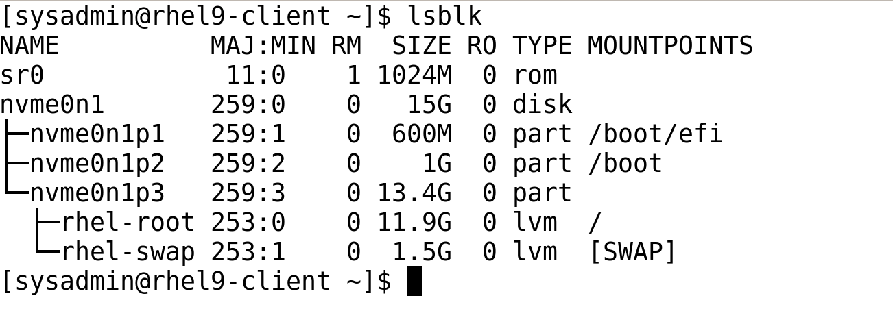
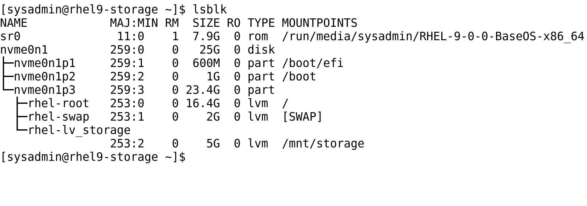
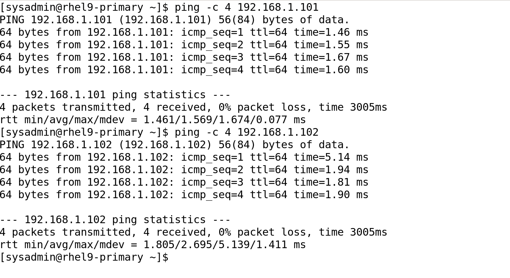
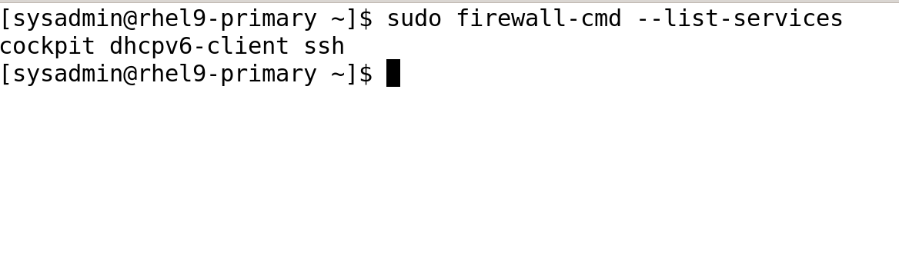
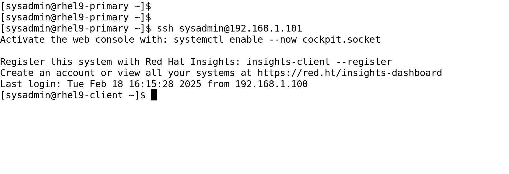

# 📸  Phase 1 Screenshots Documentation

---

## 1️⃣ Network Configuration
- **Primary VM - IP Address Configuration (`ip a`)**
  

- **Primary VM - `nmtui` Interface (Static IP Setup)**
  

---

## 2️⃣ Disk & Storage Configuration
- **Primary VM - Disk Layout (`lsblk`)**
  

- **Client VM - Disk Layout (`lsblk`)**
  

- **Storage VM - Disk Layout (`lsblk`)**
  

- **LVM Storage Setup (`lsblk` showing additional storage volumes)**
  

---

## 3️⃣ Network Connectivity Testing
- **Ping Test - Verifying VM Connectivity**
  

---

## 4️⃣ Firewall Configuration
- **Firewall Rules - Allowed Services (`firewall-cmd --list-services`)**
  

## 5️⃣ SSH Key-Based Authentication
- **Successful SSH Login Without Password**
  

